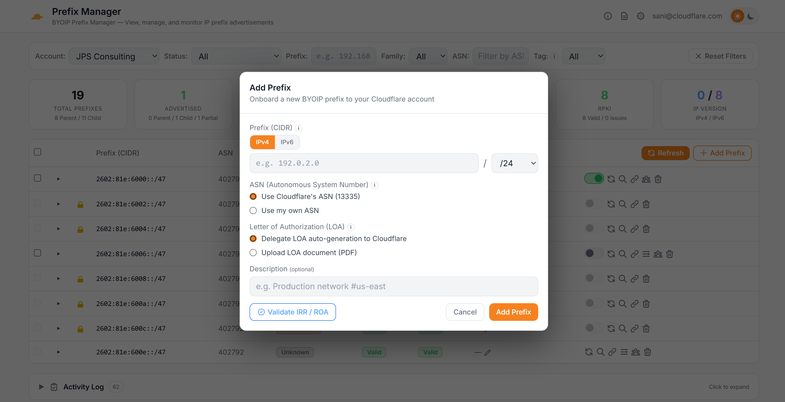
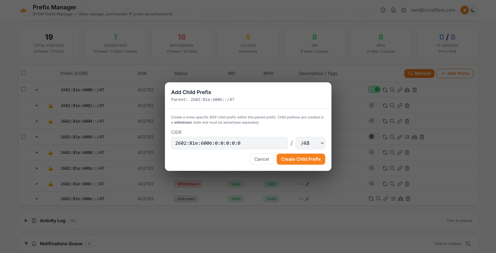
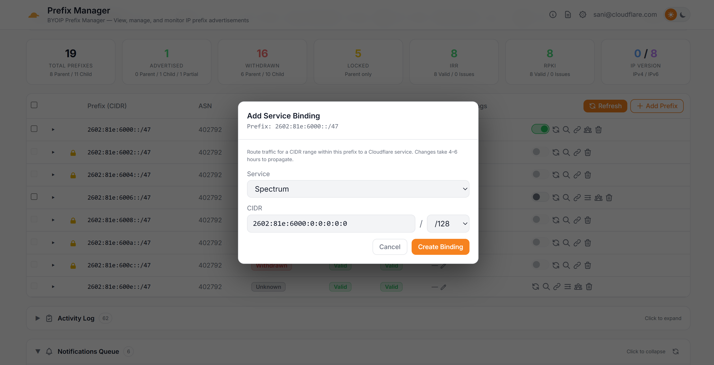
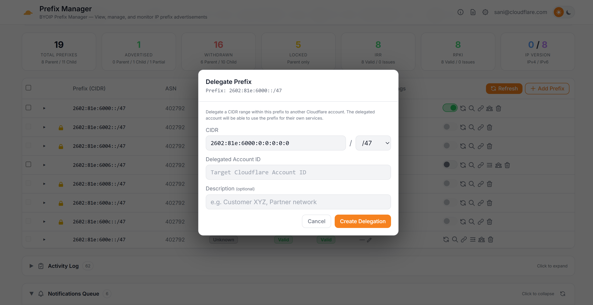
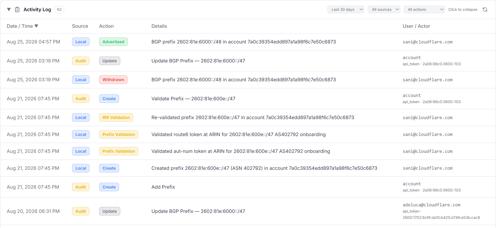
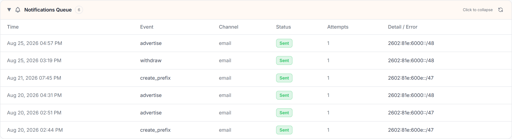

# BYOIP Prefix Manager

A Cloudflare Workers dashboard for viewing, managing, and monitoring BYOIP (Bring Your Own IP) prefixes across multiple Cloudflare accounts. Built with Hono, server-rendered HTML, and vanilla JavaScript.

**Live:** deploy your own instance (see [Setup](#setup)) — protected by Cloudflare Access with your chosen IdP


## Features

### Prefix Management
- **Add Prefix** — Onboard new BYOIP prefixes with CIDR input, ASN selection (Cloudflare 13335 or custom), LOA upload/auto-generation, pre-submission IRR/ROA validation (via RIPEstat + IRR Explorer + Cloudflare Radar), and ownership validation guidance with automated IRR route/route6 object creation and aut-num updates at ARIN and RIPE (auto-detected via RDAP)
- **Prefix Table** — View all BYOIP prefixes with CIDR, ASN, advertisement status, IRR/RPKI validation state, lock status, and description
- **Expandable Rows** — Click any prefix to drill into its BGP sub-prefixes and service bindings in a tree view
- **Filters** — Filter the table by advertisement status (advertised/withdrawn), lock state, ASN, and tags
- **Tag-Based Filtering** — Add `#tags` to prefix descriptions (e.g. `My prefix #production #us-east`) to organize prefixes. Tags appear as clickable badges in the description column and auto-populate a Tag filter dropdown. Click any tag badge to instantly filter by that tag
- **Advertisement Toggle** — Advertise or withdraw individual BGP sub-prefixes with a toggle switch and confirmation dialog; all changes are logged to an activity feed









### Looking Glass
- **BGP Route Visualization** — Click the search icon on any prefix or sub-prefix to open the looking glass modal
- **AS-Path Graph** — SVG-rendered graph showing BGP routing paths from origin to collectors, with RPKI validation coloring and ASN metadata (org name, country flag)
- **Route Table** — Tabular view of raw BGP routes including collector, AS path, next hop, and peer ASN


### Activity Log



### Notifications
- **Notifications Queue** — Delivery status (queued / sent / retrying / failed / dead-letter) is shown in the collapsible **Notifications Queue** panel on the dashboard, with a manual retry for dead-lettered/failed items



### Multi-Account & Multi-Token
- **Per-User Accounts** — Each user (identified via Cloudflare Access JWT with Google IdP) can configure multiple Cloudflare accounts, each with its own label and account ID
- **Aggregate Account View** — Enable aggregation in Settings to open prefixes and stats, activity, and notification history across all configured accounts. Each panel has an independent account filter, while its existing search and status filters continue to apply across the combined data.
- **Account-Aware Actions** — Rows retain their source account, Add Prefix prompts for a target account in the combined view, and bulk advertisement changes are safely partitioned by account.
- **Multi-Token Load Balancing** — Add multiple API tokens per account to distribute API requests via round-robin and avoid the Cloudflare API rate limit (1200 requests per endpoint per 5-minute window per token). Write operations (advertisement toggle) always use the first token for consistency.
- **Token Testing** — Test any token's permissions before saving, with inline badge feedback for IP Prefixes Read and Addressing Services Read

### UI
- **Dark/Light Theme** — Toggle between dark and light mode (persisted in localStorage)
- **Responsive** — Works on desktop and mobile; stats row collapses to 2-column grid on small screens
- **User Display** — Logged-in user email displayed in the header toolbar

## Tech Stack

| Layer | Technology |
|-------|-----------|
| Runtime | Cloudflare Workers |
| Framework | [Hono](https://hono.dev/) v4.6+ with [chanfana](https://chanfana.pages.dev/) OpenAPI |
| Frontend | Server-rendered HTML + vanilla JS |
| CSS | Tailwind CSS (CDN) + CSS custom properties |
| Database | Cloudflare D1 (SQLite) |
| Auth | Cloudflare Access (Zero Trust) with Google IdP |
| Build | Wrangler v4 |
| Language | TypeScript 5.9+ |

## Setup

### Prerequisites

- **Node.js 18+** — required to run Wrangler and install dependencies
- **Wrangler CLI v4+** — install globally with `npm install -g wrangler`, then authenticate with `wrangler login`
- **A Cloudflare account** — with a zone (domain) you control and BYOIP prefixes to manage
- **Workers Paid plan** — required for D1, Queues, and Cron Triggers (the free tier does not support Queues)

### 1. Clone and install

```bash
git clone https://github.com/YOUR_ORG/prefix-mgr.git
cd prefix-mgr
npm install
```

### 2. Create the D1 database

Create a new D1 database in your Cloudflare account and note the `database_id` from the output:

```bash
npx wrangler d1 create prefix-mgr-db
```

The output will look like:

```
✅ Successfully created DB 'prefix-mgr-db'

[[d1_databases]]
binding = "DB"
database_name = "prefix-mgr-db"
database_id = "xxxxxxxx-xxxx-xxxx-xxxx-xxxxxxxxxxxx"
```

Copy the `database_id` value — you will need it in the next step.

### 3. Configure `wrangler.toml`

```bash
cp wrangler.toml.example wrangler.toml
```

Open `wrangler.toml` and make the following changes:

1. **Set the D1 database ID** — paste the `database_id` from step 2:
   ```toml
   [[d1_databases]]
   binding = "DB"
   database_name = "prefix-mgr-db"
   database_id = "xxxxxxxx-xxxx-xxxx-xxxx-xxxxxxxxxxxx"  # ← your actual ID
   ```

2. **Set your route** — replace with your actual domain and zone:
   ```toml
   [[routes]]
   pattern = "prefix-mgr.yourdomain.com/*"
   zone_name = "yourdomain.com"
   ```

3. **Set your Cloudflare Access team name** — this is the subdomain of your Access organization (e.g. `mycompany` for `mycompany.cloudflareaccess.com`):
   ```toml
   [vars]
   ENVIRONMENT = "production"
   CF_ACCESS_TEAM_DOMAIN = "mycompany"
   ```

4. **(Optional) Add notification support** — if you want email/webhook/PagerDuty notifications for prefix events, add these blocks to `wrangler.toml`:
   ```toml
   [vars]
   ALERT_FROM_EMAIL = "alerts@yourdomain.com"   # must be a verified Resend sender

   # Queue producer (sends notifications)
   [[queues.producers]]
   binding = "NOTIFY_QUEUE"
   queue = "prefix-mgr-notifications"

   # Queue consumer (delivers notifications)
   [[queues.consumers]]
   queue = "prefix-mgr-notifications"
   max_batch_size = 10
   max_retries = 3
   dead_letter_queue = "prefix-mgr-notifications-dlq"

   # Cron trigger for Radar-based external advertisement monitoring
   [triggers]
   crons = ["* * * * *"]
   ```

### 4. Initialize the database schema

Apply the full schema to both your local dev database and the remote production database:

```bash
# Initialize local D1 (for wrangler dev)
npm run db:init

# Initialize remote/production D1
npm run db:init:remote
```

This creates all required tables (`user_accounts`, `account_tokens`, `activity_log`, `notification_channels`, `notification_log`, `prefix_radar_state`, `api_keys`, `webhook_endpoints`, `audit_log_events`, etc.). The schema uses `CREATE TABLE IF NOT EXISTS`, so it is safe to re-run.

### 5. Set up Cloudflare Access (authentication)

The dashboard is protected by Cloudflare Access. You need to create an Access Application in the [Cloudflare Zero Trust dashboard](https://one.dash.cloudflare.com/):

1. Go to **Zero Trust → Access → Applications → Add an application**
2. Choose **Self-hosted** and configure:
   - **Application domain:** `prefix-mgr.yourdomain.com`
   - **Path:** leave blank (protects the entire domain)
3. Add an **Allow** policy with your desired identity rules (e.g. emails ending in `@yourcompany.com`)
4. Choose your **Identity provider** (Google, Okta, Azure AD, etc.) — the user's email from the IdP JWT becomes their identity in the tool
5. After saving, copy the **Application Audience (AUD) Tag** from the application's overview page

Then store the AUD tag as a Wrangler secret (it is used to cryptographically verify Access JWTs):

```bash
npx wrangler secret put CF_ACCESS_AUD
# Paste the AUD tag value when prompted
```

> **Important:** Both `CF_ACCESS_TEAM_DOMAIN` (set in `wrangler.toml` `[vars]`) and `CF_ACCESS_AUD` (set as a secret) are **required** in production. The Worker fails closed with HTTP 500 if either is missing.

#### Excluding machine paths from Access

If you plan to use inbound webhooks, Logpush, or the Query API, you must create a **second** Access application to bypass Access on machine-facing paths. See [Excluding machine paths from Access](#excluding-machine-paths-from-access) for detailed instructions.

### 6. (Optional) Set up notification secrets

If you enabled notifications in step 3 and want email delivery via [Resend](https://resend.com):

1. Create the notification queues:
   ```bash
   npx wrangler queues create prefix-mgr-notifications
   npx wrangler queues create prefix-mgr-notifications-dlq
   ```

2. Store your Resend API key as a secret:
   ```bash
   npx wrangler secret put RESEND_API_KEY
   # Paste your Resend API key when prompted
   ```

3. Make sure `ALERT_FROM_EMAIL` in `wrangler.toml` `[vars]` is set to a verified sender address in your Resend account.

Webhook and PagerDuty notification channels do not require any server-side secrets — they are configured per-account in the Settings panel after deployment.

### 7. Local development

```bash
npm run dev
```

This starts a local dev server at `http://localhost:8787` with `ENVIRONMENT=development`, which bypasses Cloudflare Access authentication and uses `dev@localhost` as the user identity. You can immediately open the dashboard, add Cloudflare accounts, and test features.

### 8. Deploy to production

```bash
npm run deploy
```

After deployment, your dashboard will be live at the route you configured (e.g. `https://prefix-mgr.yourdomain.com`). Verify by visiting the URL — you should be redirected to your Cloudflare Access login.

### 9. First-time configuration in the dashboard

Once deployed and logged in:

1. **Add a Cloudflare account** — click the gear icon (Settings), then add an account with:
   - **Label:** a friendly name (e.g. "Production")
   - **Account ID:** your Cloudflare account ID (found in the Cloudflare dashboard under Account Home)
   - **API Token:** a Cloudflare API token with the required permissions (see [API Token Permissions](#api-token-permissions))
2. **Test the token** — click the "Test" button next to the token to verify it has the correct permissions
3. **Set as default** — if you have multiple accounts, set one as default
4. **View prefixes** — your BYOIP prefixes should now load in the main dashboard

### Upgrading

When pulling new versions, re-run the schema against your remote database. The schema is additive (`CREATE TABLE IF NOT EXISTS` / `CREATE INDEX IF NOT EXISTS`), so it is safe to re-apply:

```bash
npm run db:init:remote
npm run deploy
```

For specific migrations, apply the dedicated migration files required by the release:

```bash
npx wrangler d1 execute prefix-mgr-db --remote --file=migrate-query-api.sql
npx wrangler d1 execute prefix-mgr-db --remote --file=migrate-account-aggregation.sql
```

The account-aggregation migration adds the per-user dashboard preference and structured account ownership for new activity-log entries. Historical activity remains available in the all-accounts view but cannot be reliably assigned to an individual account.

## BYO-ASN Prefix Onboarding

This guide explains how to onboard an IP prefix to Cloudflare using your own Autonomous System Number (ASN).

### Requirements

Before starting, confirm that:

- Your ASN is a **public ASN** registered with ARIN, RIPE, APNIC, or AFRINIC.
- You can update the ASN's **aut-num object** at its authoritative Regional Internet Registry (RIR).
- An exact **IRR route or route6 object** exists for the prefix with your ASN as its origin.
- A valid **RPKI Route Origin Authorization (ROA)** permits your ASN to originate the prefix.

### Step 1: Create the prefix

Create the prefix through the Cloudflare API, specifying your ASN:

```http
POST /client/v4/accounts/{account_id}/addressing/prefixes
Authorization: Bearer <api_token>
Content-Type: application/json

{
  "cidr": "<your-prefix>",
  "asn": <your-asn>,
  "delegate_loa_creation": true
}
```

The response contains the prefix ID and an `ownership_validation_token`. Save both values. The token is generated by Cloudflare and should not be replaced or modified.

> **In the dashboard:** Use the **Add Prefix** modal — enter the CIDR and ASN, optionally upload an LOA, and the tool calls this API automatically.

### Step 2: Publish the validation token

Publish the same token in **both** of the following objects.

Add it to the exact **route or route6 object** for the prefix:

```
route/route6: <your-prefix>
origin:       AS<your-asn>
descr:        cf-validation: <ownership_validation_token>
```

Add it to your ASN's **aut-num object**:

```
aut-num: AS<your-asn>
descr:   cf-validation: <ownership_validation_token>
```

The route/route6 object proves control of the prefix. The aut-num object proves control of the ASN.

> **In the dashboard:** If RIR API keys are saved (ARIN or RIPE), the tool creates/updates these objects automatically via the RIR Reg-RWS / DB APIs. Otherwise it shows a manual copy-paste guide.

### Step 3: Request validation

Wait until the RIR changes are publicly visible, then request validation:

```http
POST /client/v4/accounts/{account_id}/addressing/prefixes/{prefix_id}/validate
Authorization: Bearer <api_token>
```

Validation is asynchronous and may take up to ten minutes. Check the prefix until `approved` is true:

```http
GET /client/v4/accounts/{account_id}/addressing/prefixes/{prefix_id}
Authorization: Bearer <api_token>
```

A successful onboarding reports all of these states as valid:

| State | Meaning |
|-------|---------|
| `irr_validation_state` | IRR route object exists with correct origin ASN |
| `rpki_validation_state` | ROA authorizes the ASN to originate the prefix |
| `ownership_validation_state` | Validation token found in the route object |
| `asn_ownership_validation_state` | Validation token found in the aut-num object |

### Step 4: Bind the prefix to a service

After approval, bind the full prefix to the Cloudflare service that will use it. The first binding must exactly match the onboarded prefix.

List the services available to your account:

```http
GET /client/v4/accounts/{account_id}/addressing/services
Authorization: Bearer <api_token>
```

Create the binding using the service ID returned for your product:

```http
POST /client/v4/accounts/{account_id}/addressing/prefixes/{prefix_id}/bindings
Authorization: Bearer <api_token>
Content-Type: application/json

{
  "cidr": "<your-prefix>",
  "service_id": "<service-id>"
}
```

Some Cloudflare products use a product-specific activation workflow instead of this endpoint. Follow the instructions for your product or contact your Cloudflare account team. Wait for Cloudflare to confirm activation before using the prefix for production traffic.

### Troubleshooting

| State | What to check |
|-------|---------------|
| IRR validation failed | Confirm an exact route or route6 object exists and its origin is your ASN |
| RPKI validation failed | Confirm the ROA covers the prefix and authorizes your ASN |
| Prefix ownership failed | Confirm the exact Cloudflare token appears in the prefix's route object |
| ASN ownership failed | Confirm the same token appears in your ASN's authoritative aut-num object |

RIR and RPKI updates can take time to propagate. After correcting an external record, request validation again.

> **Note:** ASN ownership normally needs to be proven only once per account and ASN. Each additional prefix still requires its own prefix and RPKI validation.

## Notifications & Reliable Delivery

Prefix Manager can send notifications for prefix/BGP/binding lifecycle events (creation, deletion,
advertise/withdraw, delegations, validation, etc.) and for **advertisement state changes detected
externally** via Cloudflare Radar. Delivery is reliable and asynchronous — every notification is
routed through a **Cloudflare Queue** with automatic retries and a dead-letter queue (DLQ).

### Requirements
- **Workers Paid plan** (Cloudflare Queues is not available on the free tier).

### 1. Create the queues (one-time)

```bash
npx wrangler queues create prefix-mgr-notifications
npx wrangler queues create prefix-mgr-notifications-dlq
```

The producer/consumer/DLQ bindings and the `* * * * *` cron trigger are already declared in
`wrangler.toml`.

### 2. Configure email delivery (Resend)

Email channels use the [Resend](https://resend.com) API:

```bash
npx wrangler secret put RESEND_API_KEY
# ALERT_FROM_EMAIL is set in wrangler.toml ([vars]) — change it to a verified sender.
```

Webhook and PagerDuty channels need no server-side secrets.

### 3. Configure per account

In **Settings → (expand an account)** you can:
- Set the **API rate limit (req / 5 min)** — used to pace the Radar poller within your account's limit.
- Add **notification channels** (email / webhook / PagerDuty) and test them.
- Choose, per event, which channels fire (**event subscriptions**).

### How external detection works

A cron job (every minute) polls a rate-limited slice of each account's advertised CIDRs against
Cloudflare Radar (`/radar/bgp/routes/realtime`) to observe the **global BGP state**. Transitions
(advertised ⇄ withdrawn, origin ASN change) raise `external_*` events. Changes made through the tool
are suppressed for a short window to avoid duplicate alerts. The monitored-CIDR list is cached and
refreshed roughly every 15 minutes to conserve API budget.

> **Rate limits:** all Cloudflare Client API calls (including Radar) share a **global 1,200 req / 5 min
> per-user limit**. The per-account rate-limit field lets the poller size its work to stay within your
> (possibly raised) limit while leaving headroom for interactive use.

## Prefix State Query API (for external tooling)

The Worker maintains a consolidated per-CIDR state snapshot in D1 (`prefix_radar_state`)
refreshed by the Radar poller and inbound webhooks. Because it serves this from D1 rather
than proxying the Cloudflare API, **other tooling can poll it for large prefix sets on a
1‑minute interval without hitting the Cloudflare API rate limit**.

### Authentication

Each Query API request must carry a **per-account API key** as a Bearer token. Keys are
created in **Settings → (expand an account) → API Access & Integrations** and are shown
**once** at creation (only a SHA‑256 hash is stored). These routes bypass Cloudflare Access.

```bash
curl -H "Authorization: Bearer pmk_xxxxx" \
  https://prefix-mgr.example.com/api/public/v1/prefixes
```

### Endpoints

| Method | Path | Description |
|--------|------|-------------|
| `GET` | `/api/public/v1/health` | Liveness + `server_time` (anchor for `since`) |
| `GET` | `/api/public/v1/prefixes` | List consolidated state for the key's account |
| `GET` | `/api/public/v1/prefixes/lookup?cidr=<cidr>` | Single-CIDR state |

`GET /api/public/v1/prefixes` query params: `advertised=true|false`, `cidr=<substr>`,
`since=<ISO timestamp>` (returns only rows updated at/after the timestamp — ideal for
incremental polling), `limit` (≤1000), `offset`. Each row returns:

```json
{
  "cidr": "192.0.2.0/24",
  "announced": true,
  "origin_asn": 13335,
  "visible_routes": 120,
  "cf_advertised": true,
  "source": "radar",
  "last_change_at": "2026-08-20T10:00:00Z",
  "last_webhook_at": null,
  "last_webhook_event": null,
  "updated_at": "2026-08-20T10:01:00Z"
}
```

The Radar-observed `announced` flag is authoritative; `cf_advertised` is the Cloudflare
control-plane intended state and `last_webhook_*` reflect inbound webhook provenance.

## Inbound Cloudflare Webhooks

The Worker can receive **generic webhook notifications from Cloudflare** (e.g. Network Flow
auto-advertisements). It validates them, updates the prefix state store, and fans the event
out through the existing notification channels/queue.

### Setup

1. In **Settings → (expand an account) → API Access & Integrations**, click **Create Secret**.
   Copy the generated secret (shown once).
2. In the Cloudflare dashboard, create a **generic webhook** notification destination:
   - **URL:** `https://prefix-mgr.example.com/webhooks/cloudflare`
   - **Secret:** paste the secret from step 1 (Cloudflare sends it in the `cf-webhook-auth`
     header; the Worker matches it by hash to resolve the account).
3. Attach the destination to the notification policies you want (e.g. Network Flow
   auto-advertisement).

Inbound payloads are parsed heuristically (CIDRs + advertise/withdraw intent extracted from
`alert_type`/`text`/`data`), stored raw in `webhook_events` for auditing, and raise
`webhook_advertise` / `webhook_withdraw` / `webhook_event` notification events. Cloudflare's
"test" ping is acknowledged with `200` and makes no state changes.

> **Important:** The `/webhooks/*` path must be excluded from your Cloudflare Access
> application, otherwise Cloudflare's delivery/validation requests are redirected (302) to
> the Access login page before they reach the Worker. See
> [Excluding machine paths from Access](#excluding-machine-paths-from-access).

### Logging & Troubleshooting

All webhook processing errors are logged via `console.error` to the **Workers runtime logs**.
View them with `wrangler tail` or in the Cloudflare dashboard under
**Workers & Pages → (your worker) → Logs → Real-time Logs**.

| Log message | Cause |
|-------------|-------|
| `webhook_events insert failed: <err>` | D1 insert of the raw webhook payload failed |
| `webhook processing failed for <cidr>: <err>` | `applyWebhookState` or `notifyWebhook` threw for a specific CIDR |

**Silent cases (no log emitted):**

- **Non-JSON body** — If the request body is not valid JSON (e.g. Cloudflare's "test" ping
  or a misconfigured sender), the handler returns `200 { ok: true, note: "no JSON body" }`
  without logging. Check the HTTP response to diagnose.
- **No CIDRs extracted** — If the parser finds no CIDRs in the payload, a `200` is returned
  with `cidrs: 0`. The raw payload is still persisted to `webhook_events` for auditing.

> The `parseCfWebhook` parser is tolerant by design — it never throws. If it cannot extract
> meaningful data, it returns empty CIDRs and `action: "unknown"`.

## Audit Log Streaming (Logpush)

The Worker can ingest an account's **Audit Logs v2** via a Cloudflare **Logpush** job that
streams to `/webhooks/logpush`, so the Activity panel loads instantly instead of polling the
Audit Logs API. This requires an **Enterprise** plan and an API token with **Logs Write**.

### Setup

1. In **Settings → (expand an account) → API Access & Integrations**, click
   **Enable audit log streaming**. The Worker mints a dedicated secret and attempts to
   create the `audit_logs_v2` Logpush job automatically.
2. On success, a job id is shown and logs begin streaming shortly. If auto-setup fails, the
   ready-to-paste HTTP destination URL is displayed for manual creation in the dashboard.

> **Important:** Before enabling, exclude `/webhooks/*` from Cloudflare Access (see
> [Excluding machine paths from Access](#excluding-machine-paths-from-access)). When Logpush
> creates a job it validates the destination by POSTing a test payload; if Access is in the
> way you'll see `error validating destination: ... status:302`. This is **not** a missing
> API permission — it's the Access edge redirect.

### Logging

Logpush processing errors are logged via `console.error` to the Workers runtime logs
(viewable with `wrangler tail`).

| Log message | Cause |
|-------------|-------|
| `logpush gunzip failed, falling back to raw text: <err>` | Gzip decompression of the Logpush payload failed; the raw bytes are decoded as plain text instead |
| `audit_log_events insert failed: <err>` | D1 insert of a parsed audit log event failed |

**Silent case:** Individual NDJSON lines that fail `JSON.parse` are silently skipped — no
log is emitted. The response reports `received` (total lines) vs `stored` (successfully
inserted), so a mismatch indicates skipped lines.

## API Token Permissions

Each user creates their own Cloudflare API tokens in the Settings panel. Tokens need these permissions:

| Permission | Access | Scope | Required For |
|-----------|--------|-------|-------------|
| **IP Prefixes** | Read | Account | Viewing prefixes, service bindings |
| **IP Prefixes** | Edit | Account | (future: prefix management) |
| **IP Prefixes: BGP On Demand** | Read | Account | Viewing BGP sub-prefixes |
| **IP Prefixes: BGP On Demand** | Edit | Account | Toggling advertisement state |

### Rate Limit & Multi-Token Strategy

The Cloudflare API enforces a rate limit of **1200 requests per endpoint per 5-minute window per API token**. When managing accounts with many prefixes, a single token can be exhausted quickly — especially when expanding rows (which triggers parallel BGP + binding fetches).

To mitigate this, add multiple API tokens per account in the Settings panel (all with the same permissions). The worker distributes read requests across them via round-robin. Write operations (advertisement toggle) always use the first token for consistency.

## Cloudflare Access

The worker is protected by a Cloudflare Access application. In production, the `Cf-Access-Jwt-Assertion` header is decoded to extract the user's email from the JWT payload. All data (accounts, tokens, activity) is scoped to the authenticated user's email.

In development (`ENVIRONMENT != "production"`), auth is bypassed with `dev@localhost`.

### Excluding machine paths from Access

Cloudflare Access runs **at the edge, before the Worker executes**. The machine-facing
routes (`/webhooks/*` and `/api/public/*`) carry their own authentication (the
`cf-webhook-auth` secret and per-account API keys, enforced in `machine-auth.ts`), so the
in-Worker Access bypass in `auth.ts` is *not enough* — Access will 302-redirect any
unauthenticated request to these paths (e.g. Cloudflare's Logpush destination-validation
POST, inbound notification webhooks) to the IdP login page before the Worker ever runs.

To fix this, create a **separate self-hosted Access application** scoped to the machine
subpaths, with a single **Bypass** policy (Include: **Everyone**). Access evaluates the
most-specific application first, so this overrides the main app for those paths only:

- `prefix-mgr.example.com/webhooks/*`
- `prefix-mgr.example.com/api/public/*`
- (optionally `/health`, `/api/docs`, `/api/openapi.json`)

Symptom if this is missing: enabling Logpush fails with
`error validating destination: error writing object: error uploading to https: status:302`.

## Project Structure

```
prefix-mgr/
├── package.json
├── tsconfig.json
├── wrangler.toml.example
├── schema.sql                  — Full database schema
├── migrate-query-api.sql       — Migration for existing deployments (Query API tables)
├── migrate-account-aggregation.sql — Migration for aggregate preferences and account-scoped activity
└── src/
    ├── index.ts                — Hono app, chanfana OpenAPI setup, route registration
    ├── helpers.ts              — Shared helpers (getToken, logActivity, resolveAccount)
    ├── ui.ts                   — Server-rendered HTML dashboard
    ├── auth.ts                 — CF Access JWT middleware
    ├── machine-auth.ts         — API-key + webhook-secret middleware for machine routes
    ├── webhooks.ts             — Inbound Cloudflare webhook handler + payload parser
    ├── types.ts                — TypeScript interfaces
    ├── api.ts                  — Cloudflare API helpers
    ├── schemas/                — Zod schemas for request/response validation & OpenAPI generation
    │   ├── common.ts           — Shared schemas (error responses, account_id query)
    │   ├── accounts.ts         — Account & token schemas
    │   ├── prefixes.ts         — Prefix, BGP, binding, delegation schemas
    │   ├── rir.ts              — RIR credential & operation schemas
    │   ├── lookups.ts          — Looking glass, RDAP, RPKI, visibility schemas
    │   └── activity.ts         — Activity log schema
    └── endpoints/              — chanfana OpenAPIRoute classes (one file per domain)
        ├── settings.ts         — Account settings endpoints
        ├── prefixes.ts         — Prefix management endpoints
        ├── bgp.ts              — BGP sub-prefix endpoints
        ├── bindings.ts         — Service binding endpoints
        ├── delegations.ts      — Delegation endpoints
        ├── services.ts         — Services endpoint
        ├── rir.ts              — RIR credentials & operations endpoints
        ├── public.ts           — Read-only prefix-state Query API (machine clients)
        ├── integrations.ts     — API key & webhook secret management (CF Access)
        └── lookups.ts          — Looking glass, RDAP, RPKI, visibility, activity endpoints
```

## Database Schema

### `user_accounts`
Stores Cloudflare account configurations per user. One row per user + account_id combination.

### `user_preferences`
Stores per-user dashboard behavior, including whether multi-account data panels default to the aggregate view.

### `account_tokens`
Stores API tokens per account. Multiple tokens per account enable round-robin load balancing. Legacy tokens from `user_accounts.api_token` are auto-migrated on first access.

### `activity_log`
Tracks dashboard, webhook, and Radar actions with user and account ownership, action details, and timestamp. Legacy rows created before the account-aggregation migration have no account ID and are shown only in the all-accounts activity view.

### `notification_channels` / `notification_subscriptions`
Per user + account delivery channels (email/webhook/PagerDuty) and per-event channel subscriptions.

### `notification_log`
One row per notification delivery attempt; tracks status (queued/sent/retrying/failed/dead_letter), attempts, and errors for the Notifications Queue panel.

### `prefix_radar_state` / `prefix_monitor_cache`
Consolidated per-CIDR state and a cache of the CIDR set to poll per account. `prefix_radar_state` holds the Radar-observed global BGP state (authoritative `announced` flag) augmented with the control-plane `cf_advertised` flag and inbound-webhook provenance (`source`, `last_webhook_at`, `last_webhook_event`).

### `api_keys` / `webhook_endpoints` / `webhook_events`
Per-account API keys for the Query API (SHA‑256 hashed), inbound webhook secrets (SHA‑256 hashed, matched against the `cf-webhook-auth` header), and an audit log of raw inbound webhook payloads.

> Existing deployments should apply the migrations required by their upgrade, including
> `migrate-query-api.sql` and `migrate-account-aggregation.sql`. Reapplying a migration that
> contains `ALTER TABLE` can report an expected "duplicate column" error.

## API Documentation

The API is fully documented with an auto-generated **OpenAPI 3.1** specification, powered by [chanfana](https://chanfana.pages.dev/) with [Zod](https://zod.dev/) schemas for request/response validation.

### Interactive Docs (Swagger UI)

Browse and test all API endpoints interactively:

- **Swagger UI:** [`/api/docs`](https://prefix-mgr.example.com/api/docs)
- **OpenAPI JSON:** [`/api/openapi.json`](https://prefix-mgr.example.com/api/openapi.json)

The OpenAPI spec can be imported into tools like Postman, Insomnia, or used for client code generation.

### Exporting the Schema

Download the OpenAPI spec for offline use or CI/CD integration:

```bash
# Download the schema
curl -o openapi.json https://prefix-mgr.example.com/api/openapi.json

# Or during local development
curl -o openapi.json http://localhost:8787/api/openapi.json
```

### API Endpoint Summary

The API is organized into the following groups (see Swagger UI for full request/response schemas):

| Group | Endpoints | Description |
|-------|-----------|-------------|
| **Account Settings** | 5 | Manage Cloudflare accounts, test API tokens |
| **Prefixes** | 7 | BYOIP prefix CRUD, validation, bulk toggle, stats |
| **BGP Prefixes** | 4 | BGP sub-prefix management and advertisement toggle |
| **Service Bindings** | 3 | Bind/unbind Cloudflare services to prefixes |
| **Delegations** | 4 | Delegate prefix CIDRs to other accounts |
| **Services** | 1 | List available Cloudflare services |
| **RIR Credentials** | 5 | Manage ARIN/RIPE credentials for automated IRR |
| **RIR Operations** | 3 | Create/update route objects and aut-num at ARIN/RIPE |
| **Lookups** | 4 | BGP looking glass, RDAP, RPKI, RIPEstat visibility |
| **Activity** | 1 | Activity log (last 50 entries) |

Additional plain routes (not in OpenAPI spec):

| Method | Path | Description |
|--------|------|-------------|
| `GET` | `/` | Dashboard HTML |
| `GET` | `/health` | Health check |
| `GET` | `/api/me` | Current user email |
| `POST` | `/api/loa-upload` | Upload LOA document (multipart/form-data) |
| `GET/POST/DELETE` | `/api/integrations/api-keys` | Manage Query API keys (CF Access) |
| `GET/POST/DELETE` | `/api/integrations/webhooks` | Manage inbound webhook secrets (CF Access) |
| `GET` | `/api/public/v1/prefixes` | Query API — consolidated prefix state (API-key auth) |
| `GET` | `/api/public/v1/prefixes/lookup` | Query API — single-CIDR state (API-key auth) |
| `GET` | `/api/public/v1/health` | Query API — liveness + server time (API-key auth) |
| `POST` | `/webhooks/cloudflare` | Inbound Cloudflare notification webhook (`cf-webhook-auth`) |
