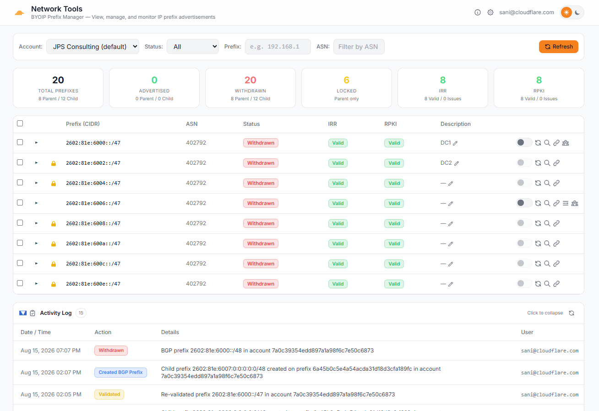

# BYOIP Prefix Manager

A Cloudflare Workers dashboard for viewing, managing, and monitoring BYOIP (Bring Your Own IP) prefixes across multiple Cloudflare accounts. Built with Hono, server-rendered HTML, and vanilla JavaScript.

**Live:** deploy your own instance (see [Setup](#setup)) — protected by Cloudflare Access with your chosen IdP



## Features

### Prefix Management
- **Add Prefix** — Onboard new BYOIP prefixes with CIDR input, ASN selection (Cloudflare 13335 or custom), LOA upload/auto-generation, pre-submission IRR/ROA validation (via RIPEstat + IRR Explorer + Cloudflare Radar), and ownership validation guidance with automated IRR route/route6 object creation and aut-num updates at ARIN and RIPE (auto-detected via RDAP)
- **Prefix Table** — View all BYOIP prefixes with CIDR, ASN, advertisement status, IRR/RPKI validation state, lock status, and description
- **Expandable Rows** — Click any prefix to drill into its BGP sub-prefixes and service bindings in a tree view
- **Filters** — Filter the table by advertisement status (advertised/withdrawn), lock state, ASN, and tags
- **Tag-Based Filtering** — Add `#tags` to prefix descriptions (e.g. `My prefix #production #us-east`) to organize prefixes. Tags appear as clickable badges in the description column and auto-populate a Tag filter dropdown. Click any tag badge to instantly filter by that tag
- **Advertisement Toggle** — Advertise or withdraw individual BGP sub-prefixes with a toggle switch and confirmation dialog; all changes are logged to an activity feed

### Looking Glass
- **BGP Route Visualization** — Click the search icon on any prefix or sub-prefix to open the looking glass modal
- **AS-Path Graph** — SVG-rendered graph showing BGP routing paths from origin to collectors, with RPKI validation coloring and ASN metadata (org name, country flag)
- **Route Table** — Tabular view of raw BGP routes including collector, AS path, next hop, and peer ASN


### Multi-Account & Multi-Token
- **Per-User Accounts** — Each user (identified via Cloudflare Access JWT with Google IdP) can configure multiple Cloudflare accounts, each with its own label and account ID
- **Multi-Token Load Balancing** — Add multiple API tokens per account to distribute API requests via round-robin and avoid the Cloudflare API rate limit (1200 requests per endpoint per 5-minute window per token). Write operations (advertisement toggle) always use the first token for consistency.
- **Token Testing** — Test any token's permissions before saving, with inline badge feedback for IP Prefixes Read and Addressing Services Read

### UI
- **Dark/Light Theme** — Toggle between dark and light mode (persisted in localStorage)
- **Responsive** — Works on desktop and mobile; stats row collapses to 2-column grid on small screens
- **User Display** — Logged-in user email displayed in the header toolbar

## Tech Stack

| Layer | Technology |
|-------|-----------|
| Runtime | Cloudflare Workers |
| Framework | [Hono](https://hono.dev/) v4.6+ with [chanfana](https://chanfana.pages.dev/) OpenAPI |
| Frontend | Server-rendered HTML + vanilla JS |
| CSS | Tailwind CSS (CDN) + CSS custom properties |
| Database | Cloudflare D1 (SQLite) |
| Auth | Cloudflare Access (Zero Trust) with Google IdP |
| Build | Wrangler v4 |
| Language | TypeScript 5.9+ |

## Setup

### Prerequisites

- Node.js 18+
- Wrangler CLI (`npm install -g wrangler`)
- A Cloudflare account with BYOIP prefixes

### 1. Clone and install

```bash
git clone https://github.com/YOUR_ORG/prefix-mgr.git
cd prefix-mgr
npm install
```

### 2. Configure Wrangler

```bash
cp wrangler.toml.example wrangler.toml
# Edit wrangler.toml:
#   - Set database_id to your D1 database ID
#   - Set CF_ACCESS_TEAM_DOMAIN to your Access team name
#   - Set ENVIRONMENT to "production" for deployment
```

### 3. Create and initialize D1 database

```bash
npm run db:create
# Copy the database_id into wrangler.toml
npm run db:init          # local
npm run db:init:remote   # production
```

If upgrading from an earlier version (before multi-token support):
```bash
npx wrangler d1 execute prefix-mgr-db --remote --file=migrate-multi-token.sql
```

### 4. Local development

```bash
npm run dev
```

Set `ENVIRONMENT = "development"` in `wrangler.toml` to bypass Cloudflare Access auth during local dev (uses `dev@localhost` as the user).

### 5. Deploy

```bash
npm run deploy
```

## Notifications & Reliable Delivery

Prefix Manager can send notifications for prefix/BGP/binding lifecycle events (creation, deletion,
advertise/withdraw, delegations, validation, etc.) and for **advertisement state changes detected
externally** via Cloudflare Radar. Delivery is reliable and asynchronous — every notification is
routed through a **Cloudflare Queue** with automatic retries and a dead-letter queue (DLQ).

### Requirements
- **Workers Paid plan** (Cloudflare Queues is not available on the free tier).

### 1. Create the queues (one-time)

```bash
npx wrangler queues create prefix-mgr-notifications
npx wrangler queues create prefix-mgr-notifications-dlq
```

The producer/consumer/DLQ bindings and the `* * * * *` cron trigger are already declared in
`wrangler.toml`.

### 2. Configure email delivery (Resend)

Email channels use the [Resend](https://resend.com) API:

```bash
npx wrangler secret put RESEND_API_KEY
# ALERT_FROM_EMAIL is set in wrangler.toml ([vars]) — change it to a verified sender.
```

Webhook and PagerDuty channels need no server-side secrets.

### 3. Configure per account

In **Settings → (expand an account)** you can:
- Set the **API rate limit (req / 5 min)** — used to pace the Radar poller within your account's limit.
- Add **notification channels** (email / webhook / PagerDuty) and test them.
- Choose, per event, which channels fire (**event subscriptions**).

Delivery status (queued / sent / retrying / failed / dead-letter) is shown in the collapsible
**Notifications Queue** panel on the dashboard, with a manual retry for dead-lettered/failed items.

### How external detection works

A cron job (every minute) polls a rate-limited slice of each account's advertised CIDRs against
Cloudflare Radar (`/radar/bgp/routes/realtime`) to observe the **global BGP state**. Transitions
(advertised ⇄ withdrawn, origin ASN change) raise `external_*` events. Changes made through the tool
are suppressed for a short window to avoid duplicate alerts. The monitored-CIDR list is cached and
refreshed roughly every 15 minutes to conserve API budget.

> **Rate limits:** all Cloudflare Client API calls (including Radar) share a **global 1,200 req / 5 min
> per-user limit**. The per-account rate-limit field lets the poller size its work to stay within your
> (possibly raised) limit while leaving headroom for interactive use.

## Prefix State Query API (for external tooling)

The Worker maintains a consolidated per-CIDR state snapshot in D1 (`prefix_radar_state`)
refreshed by the Radar poller and inbound webhooks. Because it serves this from D1 rather
than proxying the Cloudflare API, **other tooling can poll it for large prefix sets on a
1‑minute interval without hitting the Cloudflare API rate limit**.

### Authentication

Each Query API request must carry a **per-account API key** as a Bearer token. Keys are
created in **Settings → (expand an account) → API Access & Integrations** and are shown
**once** at creation (only a SHA‑256 hash is stored). These routes bypass Cloudflare Access.

```bash
curl -H "Authorization: Bearer pmk_xxxxx" \
  https://prefix-mgr.example.com/api/public/v1/prefixes
```

### Endpoints

| Method | Path | Description |
|--------|------|-------------|
| `GET` | `/api/public/v1/health` | Liveness + `server_time` (anchor for `since`) |
| `GET` | `/api/public/v1/prefixes` | List consolidated state for the key's account |
| `GET` | `/api/public/v1/prefixes/lookup?cidr=<cidr>` | Single-CIDR state |

`GET /api/public/v1/prefixes` query params: `advertised=true|false`, `cidr=<substr>`,
`since=<ISO timestamp>` (returns only rows updated at/after the timestamp — ideal for
incremental polling), `limit` (≤1000), `offset`. Each row returns:

```json
{
  "cidr": "192.0.2.0/24",
  "announced": true,
  "origin_asn": 13335,
  "visible_routes": 120,
  "cf_advertised": true,
  "source": "radar",
  "last_change_at": "2026-08-20T10:00:00Z",
  "last_webhook_at": null,
  "last_webhook_event": null,
  "updated_at": "2026-08-20T10:01:00Z"
}
```

The Radar-observed `announced` flag is authoritative; `cf_advertised` is the Cloudflare
control-plane intended state and `last_webhook_*` reflect inbound webhook provenance.

## Inbound Cloudflare Webhooks

The Worker can receive **generic webhook notifications from Cloudflare** (e.g. Network Flow
auto-advertisements). It validates them, updates the prefix state store, and fans the event
out through the existing notification channels/queue.

### Setup

1. In **Settings → (expand an account) → API Access & Integrations**, click **Create Secret**.
   Copy the generated secret (shown once).
2. In the Cloudflare dashboard, create a **generic webhook** notification destination:
   - **URL:** `https://prefix-mgr.example.com/webhooks/cloudflare`
   - **Secret:** paste the secret from step 1 (Cloudflare sends it in the `cf-webhook-auth`
     header; the Worker matches it by hash to resolve the account).
3. Attach the destination to the notification policies you want (e.g. Network Flow
   auto-advertisement).

Inbound payloads are parsed heuristically (CIDRs + advertise/withdraw intent extracted from
`alert_type`/`text`/`data`), stored raw in `webhook_events` for auditing, and raise
`webhook_advertise` / `webhook_withdraw` / `webhook_event` notification events. Cloudflare's
"test" ping is acknowledged with `200` and makes no state changes.

## API Token Permissions

Each user creates their own Cloudflare API tokens in the Settings panel. Tokens need these permissions:

| Permission | Access | Scope | Required For |
|-----------|--------|-------|-------------|
| **IP Prefixes** | Read | Account | Viewing prefixes, service bindings |
| **IP Prefixes** | Edit | Account | (future: prefix management) |
| **IP Prefixes: BGP On Demand** | Read | Account | Viewing BGP sub-prefixes |
| **IP Prefixes: BGP On Demand** | Edit | Account | Toggling advertisement state |

### Rate Limit & Multi-Token Strategy

The Cloudflare API enforces a rate limit of **1200 requests per endpoint per 5-minute window per API token**. When managing accounts with many prefixes, a single token can be exhausted quickly — especially when expanding rows (which triggers parallel BGP + binding fetches).

To mitigate this, add multiple API tokens per account in the Settings panel (all with the same permissions). The worker distributes read requests across them via round-robin. Write operations (advertisement toggle) always use the first token for consistency.

## Cloudflare Access

The worker is protected by a Cloudflare Access application. In production, the `Cf-Access-Jwt-Assertion` header is decoded to extract the user's email from the JWT payload. All data (accounts, tokens, activity) is scoped to the authenticated user's email.

In development (`ENVIRONMENT != "production"`), auth is bypassed with `dev@localhost`.

## Project Structure

```
prefix-mgr/
├── package.json
├── tsconfig.json
├── wrangler.toml.example
├── schema.sql                  — Full schema (user_accounts + account_tokens + activity_log)
├── migrate-multi-token.sql     — Migration for existing deployments
└── src/
    ├── index.ts                — Hono app, chanfana OpenAPI setup, route registration
    ├── helpers.ts              — Shared helpers (getToken, logActivity, resolveAccount)
    ├── ui.ts                   — Server-rendered HTML dashboard
    ├── auth.ts                 — CF Access JWT middleware
    ├── machine-auth.ts         — API-key + webhook-secret middleware for machine routes
    ├── webhooks.ts             — Inbound Cloudflare webhook handler + payload parser
    ├── types.ts                — TypeScript interfaces
    ├── api.ts                  — Cloudflare API helpers
    ├── schemas/                — Zod schemas for request/response validation & OpenAPI generation
    │   ├── common.ts           — Shared schemas (error responses, account_id query)
    │   ├── accounts.ts         — Account & token schemas
    │   ├── prefixes.ts         — Prefix, BGP, binding, delegation schemas
    │   ├── rir.ts              — RIR credential & operation schemas
    │   ├── lookups.ts          — Looking glass, RDAP, RPKI, visibility schemas
    │   └── activity.ts         — Activity log schema
    └── endpoints/              — chanfana OpenAPIRoute classes (one file per domain)
        ├── settings.ts         — Account settings endpoints
        ├── prefixes.ts         — Prefix management endpoints
        ├── bgp.ts              — BGP sub-prefix endpoints
        ├── bindings.ts         — Service binding endpoints
        ├── delegations.ts      — Delegation endpoints
        ├── services.ts         — Services endpoint
        ├── rir.ts              — RIR credentials & operations endpoints
        ├── public.ts           — Read-only prefix-state Query API (machine clients)
        ├── integrations.ts     — API key & webhook secret management (CF Access)
        └── lookups.ts          — Looking glass, RDAP, RPKI, visibility, activity endpoints
```

## Database Schema

### `user_accounts`
Stores Cloudflare account configurations per user. One row per user + account_id combination.

### `account_tokens`
Stores API tokens per account. Multiple tokens per account enable round-robin load balancing. Legacy tokens from `user_accounts.api_token` are auto-migrated on first access.

### `activity_log`
Tracks advertisement toggle actions (advertise/withdraw) with user email, action, details, and timestamp.

### `notification_channels` / `notification_subscriptions`
Per user + account delivery channels (email/webhook/PagerDuty) and per-event channel subscriptions.

### `notification_log`
One row per notification delivery attempt; tracks status (queued/sent/retrying/failed/dead_letter), attempts, and errors for the Notifications Queue panel.

### `prefix_radar_state` / `prefix_monitor_cache`
Consolidated per-CIDR state and a cache of the CIDR set to poll per account. `prefix_radar_state` holds the Radar-observed global BGP state (authoritative `announced` flag) augmented with the control-plane `cf_advertised` flag and inbound-webhook provenance (`source`, `last_webhook_at`, `last_webhook_event`).

### `api_keys` / `webhook_endpoints` / `webhook_events`
Per-account API keys for the Query API (SHA‑256 hashed), inbound webhook secrets (SHA‑256 hashed, matched against the `cf-webhook-auth` header), and an audit log of raw inbound webhook payloads.

> Existing deployments: apply the additive migration with
> `npx wrangler d1 execute prefix-mgr-db --remote --file=migrate-query-api.sql`
> (the `ALTER TABLE` statements safely error with "duplicate column" if already applied).

## API Documentation

The API is fully documented with an auto-generated **OpenAPI 3.1** specification, powered by [chanfana](https://chanfana.pages.dev/) with [Zod](https://zod.dev/) schemas for request/response validation.

### Interactive Docs (Swagger UI)

Browse and test all API endpoints interactively:

- **Swagger UI:** [`/api/docs`](https://prefix-mgr.example.com/api/docs)
- **OpenAPI JSON:** [`/api/openapi.json`](https://prefix-mgr.example.com/api/openapi.json)

The OpenAPI spec can be imported into tools like Postman, Insomnia, or used for client code generation.

### Exporting the Schema

Download the OpenAPI spec for offline use or CI/CD integration:

```bash
# Download the schema
curl -o openapi.json https://prefix-mgr.example.com/api/openapi.json

# Or during local development
curl -o openapi.json http://localhost:8787/api/openapi.json
```

### API Endpoint Summary

The API is organized into the following groups (see Swagger UI for full request/response schemas):

| Group | Endpoints | Description |
|-------|-----------|-------------|
| **Account Settings** | 5 | Manage Cloudflare accounts, test API tokens |
| **Prefixes** | 7 | BYOIP prefix CRUD, validation, bulk toggle, stats |
| **BGP Prefixes** | 4 | BGP sub-prefix management and advertisement toggle |
| **Service Bindings** | 3 | Bind/unbind Cloudflare services to prefixes |
| **Delegations** | 4 | Delegate prefix CIDRs to other accounts |
| **Services** | 1 | List available Cloudflare services |
| **RIR Credentials** | 5 | Manage ARIN/RIPE credentials for automated IRR |
| **RIR Operations** | 3 | Create/update route objects and aut-num at ARIN/RIPE |
| **Lookups** | 4 | BGP looking glass, RDAP, RPKI, RIPEstat visibility |
| **Activity** | 1 | Activity log (last 50 entries) |

Additional plain routes (not in OpenAPI spec):

| Method | Path | Description |
|--------|------|-------------|
| `GET` | `/` | Dashboard HTML |
| `GET` | `/health` | Health check |
| `GET` | `/api/me` | Current user email |
| `POST` | `/api/loa-upload` | Upload LOA document (multipart/form-data) |
| `GET/POST/DELETE` | `/api/integrations/api-keys` | Manage Query API keys (CF Access) |
| `GET/POST/DELETE` | `/api/integrations/webhooks` | Manage inbound webhook secrets (CF Access) |
| `GET` | `/api/public/v1/prefixes` | Query API — consolidated prefix state (API-key auth) |
| `GET` | `/api/public/v1/prefixes/lookup` | Query API — single-CIDR state (API-key auth) |
| `GET` | `/api/public/v1/health` | Query API — liveness + server time (API-key auth) |
| `POST` | `/webhooks/cloudflare` | Inbound Cloudflare notification webhook (`cf-webhook-auth`) |
