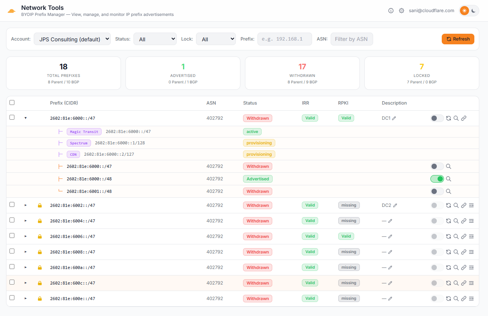
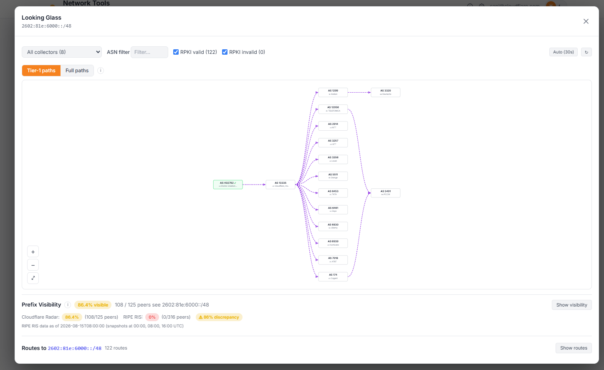

# Network Tools — BYOIP Prefix Manager

A Cloudflare Workers dashboard for viewing, managing, and monitoring BYOIP (Bring Your Own IP) prefixes across multiple Cloudflare accounts. Built with Hono, server-rendered HTML, and vanilla JavaScript.

**Live:** [network-tools.example.com](https://network-tools.example.com) (Cloudflare Access — Google IdP)



## Features

### Prefix Management
- **Add Prefix** — Onboard new BYOIP prefixes with CIDR input, ASN selection (Cloudflare 13335 or custom), LOA upload/auto-generation, pre-submission IRR/ROA validation (via RIPEstat + IRR Explorer + Cloudflare Radar), and ownership validation guidance
- **Prefix Table** — View all BYOIP prefixes with CIDR, ASN, advertisement status, IRR/RPKI validation state, lock status, and description
- **Expandable Rows** — Click any prefix to drill into its BGP sub-prefixes and service bindings in a tree view
- **Filters** — Filter the table by advertisement status (advertised/withdrawn), lock state, ASN, and tags
- **Tag-Based Filtering** — Add `#tags` to prefix descriptions (e.g. `My prefix #production #us-east`) to organize prefixes. Tags appear as clickable badges in the description column and auto-populate a Tag filter dropdown. Click any tag badge to instantly filter by that tag
- **Advertisement Toggle** — Advertise or withdraw individual BGP sub-prefixes with a toggle switch and confirmation dialog; all changes are logged to an activity feed

### Looking Glass
- **BGP Route Visualization** — Click the search icon on any prefix or sub-prefix to open the looking glass modal
- **AS-Path Graph** — SVG-rendered graph showing BGP routing paths from origin to collectors, with RPKI validation coloring and ASN metadata (org name, country flag)
- **Route Table** — Tabular view of raw BGP routes including collector, AS path, next hop, and peer ASN



### Multi-Account & Multi-Token
- **Per-User Accounts** — Each user (identified via Cloudflare Access JWT with Google IdP) can configure multiple Cloudflare accounts, each with its own label and account ID
- **Multi-Token Load Balancing** — Add multiple API tokens per account to distribute API requests via round-robin and avoid the Cloudflare API rate limit (1200 requests per endpoint per 5-minute window per token). Write operations (advertisement toggle) always use the first token for consistency.
- **Token Testing** — Test any token's permissions before saving, with inline badge feedback for IP Prefixes Read and Addressing Services Read

### UI
- **Dark/Light Theme** — Toggle between dark and light mode (persisted in localStorage)
- **Responsive** — Works on desktop and mobile; stats row collapses to 2-column grid on small screens
- **User Display** — Logged-in user email displayed in the header toolbar

## Tech Stack

| Layer | Technology |
|-------|-----------|
| Runtime | Cloudflare Workers |
| Framework | [Hono](https://hono.dev/) v4.6+ |
| Frontend | Server-rendered HTML + vanilla JS |
| CSS | Tailwind CSS (CDN) + CSS custom properties |
| Database | Cloudflare D1 (SQLite) |
| Auth | Cloudflare Access (Zero Trust) with Google IdP |
| Build | Wrangler v4 |
| Language | TypeScript 5.9+ |

## Setup

### Prerequisites

- Node.js 18+
- Wrangler CLI (`npm install -g wrangler`)
- A Cloudflare account with BYOIP prefixes

### 1. Clone and install

```bash
git clone https://github.com/YOUR_ORG/prefix-mgr.git
cd network-tools
npm install
```

### 2. Configure Wrangler

```bash
cp wrangler.toml.example wrangler.toml
# Edit wrangler.toml:
#   - Set database_id to your D1 database ID
#   - Set CF_ACCESS_TEAM_DOMAIN to your Access team name
#   - Set ENVIRONMENT to "production" for deployment
```

### 3. Create and initialize D1 database

```bash
npm run db:create
# Copy the database_id into wrangler.toml
npm run db:init          # local
npm run db:init:remote   # production
```

If upgrading from an earlier version (before multi-token support):
```bash
npx wrangler d1 execute network-tools-db --remote --file=migrate-multi-token.sql
```

### 4. Local development

```bash
npm run dev
```

Set `ENVIRONMENT = "development"` in `wrangler.toml` to bypass Cloudflare Access auth during local dev (uses `dev@localhost` as the user).

### 5. Deploy

```bash
npm run deploy
```

## API Token Permissions

Each user creates their own Cloudflare API tokens in the Settings panel. Tokens need these permissions:

| Permission | Access | Scope | Required For |
|-----------|--------|-------|-------------|
| **IP Prefixes** | Read | Account | Viewing prefixes, service bindings |
| **IP Prefixes** | Edit | Account | (future: prefix management) |
| **IP Prefixes: BGP On Demand** | Read | Account | Viewing BGP sub-prefixes |
| **IP Prefixes: BGP On Demand** | Edit | Account | Toggling advertisement state |

### Rate Limit & Multi-Token Strategy

The Cloudflare API enforces a rate limit of **1200 requests per endpoint per 5-minute window per API token**. When managing accounts with many prefixes, a single token can be exhausted quickly — especially when expanding rows (which triggers parallel BGP + binding fetches).

To mitigate this, add multiple API tokens per account in the Settings panel (all with the same permissions). The worker distributes read requests across them via round-robin. Write operations (advertisement toggle) always use the first token for consistency.

## Cloudflare Access

The worker is protected by a Cloudflare Access application. In production, the `Cf-Access-Jwt-Assertion` header is decoded to extract the user's email from the JWT payload. All data (accounts, tokens, activity) is scoped to the authenticated user's email.

In development (`ENVIRONMENT != "production"`), auth is bypassed with `dev@localhost`.

## Project Structure

```
network-tools/
├── package.json
├── tsconfig.json
├── wrangler.toml.example
├── schema.sql                  — Full schema (user_accounts + account_tokens + activity_log)
├── migrate-multi-token.sql     — Migration for existing deployments
└── src/
    ├── index.ts    — Hono app, API routes, token pool logic
    ├── ui.ts       — Server-rendered HTML dashboard (925+ lines)
    ├── auth.ts     — CF Access JWT middleware
    ├── types.ts    — TypeScript interfaces
    └── api.ts      — Cloudflare API helpers
```

## Database Schema

### `user_accounts`
Stores Cloudflare account configurations per user. One row per user + account_id combination.

### `account_tokens`
Stores API tokens per account. Multiple tokens per account enable round-robin load balancing. Legacy tokens from `user_accounts.api_token` are auto-migrated on first access.

### `activity_log`
Tracks advertisement toggle actions (advertise/withdraw) with user email, action, details, and timestamp.

## API Endpoints

| Method | Path | Description |
|--------|------|-------------|
| `GET` | `/` | Dashboard HTML |
| `GET` | `/health` | Health check |
| `GET` | `/api/me` | Current user email |
| `GET` | `/api/settings` | List accounts (with token counts) |
| `POST` | `/api/settings` | Add/update account (label + account_id) |
| `DELETE` | `/api/settings/:id` | Delete account (cascades to tokens) |
| `PUT` | `/api/settings/:id/default` | Set default account |
| `GET` | `/api/tokens` | List tokens for an account (masked) |
| `POST` | `/api/tokens` | Add token to an account |
| `DELETE` | `/api/tokens/:id` | Delete a token |
| `POST` | `/api/test-token` | Validate token permissions |
| `POST` | `/api/prefixes` | Create new BYOIP prefix |
| `POST` | `/api/prefixes/validate-new` | Pre-submission IRR/ROA validation |
| `POST` | `/api/loa-upload` | Upload LOA document (PDF) |
| `GET` | `/api/prefixes` | List BYOIP prefixes |
| `GET` | `/api/prefixes/:id/bgp` | List BGP sub-prefixes |
| `POST` | `/api/prefixes/:id/bgp` | Create BGP child prefix |
| `DELETE` | `/api/prefixes/:pid/bgp/:bid` | Delete BGP child prefix |
| `GET` | `/api/prefixes/:id/bindings` | List service bindings |
| `POST` | `/api/prefixes/:id/bindings` | Create service binding |
| `DELETE` | `/api/prefixes/:pid/bindings/:bid` | Delete service binding |
| `GET` | `/api/services` | List available services |
| `POST` | `/api/prefixes/:pid/bgp/:bid/toggle` | Toggle BGP advertisement |
| `POST` | `/api/looking-glass` | BGP route lookup (Radar API) |
| `GET` | `/api/activity` | Activity log (last 50 entries) |
